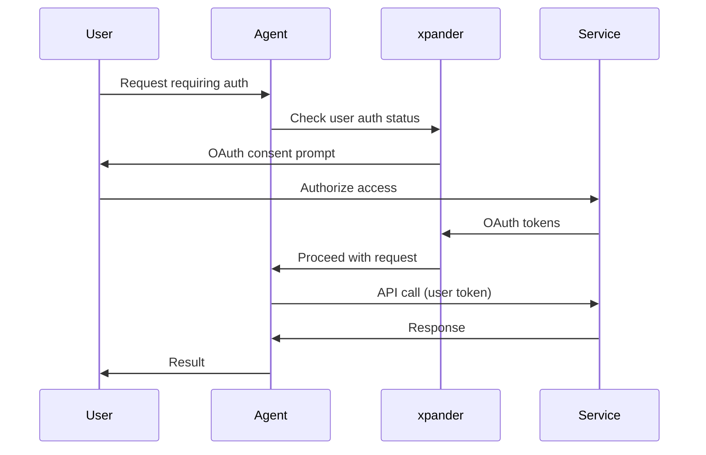

MCP End-User Authentication allows your agents to access services on behalf of individual users. Instead of using shared integration credentials, each user authenticates with their own account, enabling personalized and secure access.

## Overview

<CardGroup cols={2}>
  <Card title="User-Level Access" icon="user">
    Each user authenticates with their own credentials
  </Card>
  <Card title="OAuth 2.0 Flows" icon="shield-check">
    Standard OAuth with PKCE support
  </Card>
  <Card title="Token Management" icon="key">
    Automatic refresh and secure storage
  </Card>
  <Card title="Consent Tracking" icon="check-double">
    Track which users have authorized access
  </Card>
</CardGroup>

## Use Cases

End-user authentication is ideal for:

- **Personal Assistants** - Access user's own calendar, email, files
- **Slack Agents** - Perform actions as the requesting user
- **Multi-tenant Apps** - Separate data access per user
- **Compliance** - Audit trail of user-initiated actions

## How It Works



## Configuration

### Enable End-User Auth

In the Workbench:

1. Navigate to **Agent Settings > Connections**
2. Select the MCP server or connector
3. Choose **End-User Authentication** mode
4. Configure OAuth settings

### OAuth Settings

```yaml
authentication:
  mode: end_user
  oauth:
    authorization_url: "https://service.com/oauth/authorize"
    token_url: "https://service.com/oauth/token"
    scopes:
      - read
      - write
    pkce: true
    client_id: "${CLIENT_ID}"
    client_secret: "${CLIENT_SECRET}"
```

## SDK Integration

### Check Authentication Status

```python
from xpander_sdk import Backend, UserAuth

backend = Backend()
auth = UserAuth(backend)

# Check if user has authorized
user_id = "user-123"
is_authorized = auth.is_authorized(
    user_id=user_id,
    connector="google-calendar"
)

if not is_authorized:
    # Get OAuth URL for user
    auth_url = auth.get_authorization_url(
        user_id=user_id,
        connector="google-calendar",
        redirect_uri="https://myapp.com/callback"
    )
    print(f"User needs to authorize: {auth_url}")
```

### Handle OAuth Callback

```python
from xpander_sdk import UserAuth

auth = UserAuth(backend)

# Exchange code for tokens
auth.handle_callback(
    user_id="user-123",
    connector="google-calendar",
    code="authorization_code",
    state="state_parameter"
)

print("User successfully authorized!")
```

### Make Authenticated Requests

```python
from xpander_sdk import Backend
from agno.agent import Agent

backend = Backend()

# User context automatically applied
agent = Agent(
    **backend.get_args(),
    user_id="user-123"  # Requests use this user's tokens
)

# Agent uses user-123's Google Calendar credentials
response = agent.run("What meetings do I have today?")
```

## Slack Integration

For Slack agents, end-user auth happens automatically:

```python
from xpander_sdk import Backend

backend = Backend()

# Slack user ID extracted from message
# Their OAuth tokens used for connected services
task = backend.get_current_task()
slack_user_id = task.metadata.get("slack_user_id")

# Connector calls use this user's tokens
```

### Slack OAuth Flow

1. User interacts with Slack agent
2. Agent needs to access user's Google Calendar
3. Agent sends OAuth link to user via DM
4. User clicks link and authorizes
5. Future requests use user's tokens

## Token Management

### Automatic Refresh

xpander automatically refreshes expired tokens:

```python
# Tokens refreshed transparently
# No code changes needed
agent.run("Check my calendar")  # Uses fresh token
```

### Manual Token Refresh

```python
from xpander_sdk import UserAuth

auth = UserAuth(backend)

# Force token refresh
auth.refresh_token(
    user_id="user-123",
    connector="google-calendar"
)
```

### Revoke Access

```python
# Revoke user's authorization
auth.revoke(
    user_id="user-123",
    connector="google-calendar"
)
```

## Security Considerations

<Warning>
End-user tokens provide access to sensitive user data. Follow these best practices:
</Warning>

1. **Minimize Scopes** - Only request necessary permissions
2. **Audit Access** - Log all API calls with user context
3. **Token Encryption** - Tokens encrypted at rest (automatic)
4. **Consent UI** - Clear explanation of requested access
5. **Revocation** - Provide easy way to revoke access

## Consent Management

Track and manage user authorizations:

```python
from xpander_sdk import UserAuth

auth = UserAuth(backend)

# List all authorizations for a user
authorizations = auth.list_authorizations(user_id="user-123")

for authz in authorizations:
    print(f"{authz.connector}: {authz.scopes}")
    print(f"  Authorized: {authz.created_at}")
    print(f"  Last used: {authz.last_used_at}")
```

## Related

<CardGroup cols={2}>
  <Card title="Tools & Connectors" icon="plug" href="/user-guide/build/connectors">
    Connector authentication options
  </Card>
  <Card title="Slack Integration" icon="slack" href="/user-guide/scale/slack">
    Slack agent setup
  </Card>
</CardGroup>
