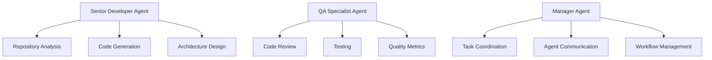
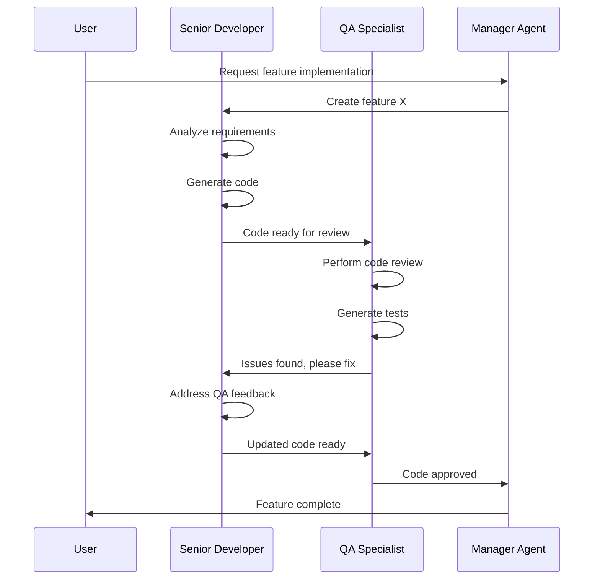

<Note>
  **Module Summary**

  - **Goal**: Create a second specialized coding agent and understand agent differentiation
  - **Estimated Time**: 20-25 minutes
  - **Prerequisites**: Completed Module 1, working first coding agent
</Note>

🔥 In this module, you'll create a second coding agent with different specializations and capabilities. You'll learn how to design complementary agents that work together effectively, setting the foundation for Agent-to-Agent (A2A) communication patterns that we'll implement in Module 3.

## 🎯 Agent Specialization Strategy

### Why Multiple Agents?

Instead of creating one agent that does everything, specialized agents offer several advantages:

1. **Focus and Expertise** - Each agent excels in specific areas
2. **Scalability** - Distribute workload across multiple agents
3. **Reliability** - If one agent fails, others can continue working
4. **Maintainability** - Easier to update and optimize specific capabilities
5. **Parallel Processing** - Multiple agents can work simultaneously

### Agent Fleet Architecture



## 🛠️ Creating Your QA Specialist Agent

### Step 1: Design the Second Agent

Let's create a Quality Assurance (QA) specialist agent that complements your Senior Developer Agent:

1. In the xpander.ai platform, go to **Agents**
2. Click **\+ New Agent** to create your second agent
3. Skip the agent builder to create manually

### Step 2: Configure QA Agent Identity

Configure your QA agent with a specialized role:

```txt Agent Name
QA Specialist Agent
```

```txt Role
You are a QA Specialist Agent focused on code quality, testing, and best practices. You have expertise in static analysis, test automation, security scanning, and performance optimization. You work collaboratively with development agents to ensure high-quality code delivery.
```

```txt Goal
Your goal is to review code, identify quality issues, suggest improvements, and ensure that all code meets industry standards for security, performance, and maintainability. You prioritize comprehensive testing and thorough documentation.
```

```txt Instructions
1. Always perform thorough code reviews focusing on quality, security, and performance
2. Identify potential bugs, security vulnerabilities, and performance bottlenecks
3. Suggest specific improvements with code examples when possible
4. Ensure proper test coverage and recommend additional test cases
5. Check for code style consistency and adherence to best practices
6. Validate error handling and edge case coverage
7. Use local functions for automated testing and quality analysis
8. Provide detailed feedback with severity levels and remediation steps
```

### Step 3: Add Specialized QA Tools

Add tools that complement the QA specialist role:

1. Click **\+** in your agent canvas
2. Add **GitHub Issues Manager** for issue tracking and bug reporting
3. Add **GitHub Actions Manager** for CI/CD pipeline management
4. Configure the integrations with your GitHub account

<Tip>
  Notice how we're adding different tools than the first agent. This specialization helps each agent excel in their specific domain while avoiding overlap.
</Tip>

## 🧪 Implementing QA-Focused Local Functions

### Step 4: Create Code Review Function

Create a specialized function for automated code review:

1. Go to **Cloud Functions** and click **New**
2. Create this comprehensive code review function:

```python Code Review Function
# === Code Review Analyzer ===
# Contract-name: xpander_run_action
# Purpose: Automated code review and quality analysis

import os
import re
import ast
import subprocess
from pathlib import Path
from typing import Dict, List, Any

def xpander_run_action(file_path: str, review_type: str = "comprehensive"):
    """
    Perform automated code review and quality analysis
    
    Args:
        file_path: Path to the code file to review
        review_type: Type of review ("security", "performance", "comprehensive")
        
    Returns:
        dict: Review results with issues and recommendations
    """
    
    try:
        if not os.path.exists(file_path):
            return {"error": f"File not found: {file_path}"}
        
        with open(file_path, 'r', encoding='utf-8') as f:
            code_content = f.read()
        
        file_ext = Path(file_path).suffix.lower()
        
        if file_ext == '.py':
            return review_python_code(code_content, review_type)
        elif file_ext in ['.js', '.ts']:
            return review_javascript_code(code_content, review_type)
        else:
            return review_generic_code(code_content, review_type)
            
    except Exception as e:
        return {"error": f"Review failed: {str(e)}"}

def review_python_code(code: str, review_type: str) -> Dict[str, Any]:
    """Comprehensive Python code review"""
    issues = []
    suggestions = []
    metrics = {"complexity": 0, "maintainability": 100, "security_score": 100}
    
    # Security checks
    if review_type in ["security", "comprehensive"]:
        security_issues = check_python_security(code)
        issues.extend(security_issues)
        if security_issues:
            metrics["security_score"] -= len(security_issues) * 10
    
    # Performance checks  
    if review_type in ["performance", "comprehensive"]:
        performance_issues = check_python_performance(code)
        issues.extend(performance_issues)
    
    # Code quality checks
    if review_type == "comprehensive":
        quality_issues = check_python_quality(code)
        issues.extend(quality_issues)
        
        # Calculate complexity
        try:
            tree = ast.parse(code)
            complexity = calculate_complexity(tree)
            metrics["complexity"] = complexity
            
            if complexity > 10:
                issues.append({
                    "type": "complexity",
                    "severity": "high",
                    "message": f"Cyclomatic complexity too high: {complexity}",
                    "suggestion": "Consider breaking down complex functions into smaller ones"
                })
        except SyntaxError:
            issues.append({
                "type": "syntax",
                "severity": "critical", 
                "message": "Syntax error in code",
                "suggestion": "Fix syntax errors before proceeding"
            })
    
    # Generate overall recommendations
    if len(issues) == 0:
        suggestions.append("Code quality is excellent! No issues found.")
    elif len(issues) <= 3:
        suggestions.append("Minor issues found. Consider addressing them for better code quality.")
    else:
        suggestions.append("Multiple issues found. Recommend comprehensive refactoring.")
    
    return {
        "file_type": "python",
        "issues": issues,
        "suggestions": suggestions,
        "metrics": metrics,
        "summary": f"Found {len(issues)} issues across {review_type} review"
    }

def check_python_security(code: str) -> List[Dict[str, str]]:
    """Check for common Python security issues"""
    issues = []
    
    # Check for dangerous imports
    dangerous_patterns = [
        (r'import\s+pickle', "Using pickle can be unsafe with untrusted data"),
        (r'eval\s*\(', "eval() can execute arbitrary code - very dangerous"),
        (r'exec\s*\(', "exec() can execute arbitrary code - very dangerous"),
        (r'subprocess\.call\([^)]*shell=True', "shell=True in subprocess can be dangerous"),
        (r'os\.system\s*\(', "os.system() can be vulnerable to injection attacks"),
    ]
    
    for pattern, message in dangerous_patterns:
        if re.search(pattern, code):
            issues.append({
                "type": "security",
                "severity": "high",
                "message": message,
                "suggestion": "Use safer alternatives or validate inputs thoroughly"
            })
    
    # Check for hardcoded secrets
    secret_patterns = [
        (r'password\s*=\s*["\'][^"\']+["\']', "Hardcoded password detected"),
        (r'api_key\s*=\s*["\'][^"\']+["\']', "Hardcoded API key detected"),
        (r'secret\s*=\s*["\'][^"\']+["\']', "Hardcoded secret detected"),
    ]
    
    for pattern, message in secret_patterns:
        if re.search(pattern, code, re.IGNORECASE):
            issues.append({
                "type": "security",
                "severity": "critical",
                "message": message,
                "suggestion": "Use environment variables or secure key management"
            })
    
    return issues

def check_python_performance(code: str) -> List[Dict[str, str]]:
    """Check for common Python performance issues"""
    issues = []
    
    performance_patterns = [
        (r'for\s+\w+\s+in\s+range\(len\([^)]+\)\):', "Use enumerate() instead of range(len())"),
        (r'\+\s*=.*\[.*\]', "String concatenation in loop - use join() instead"),
        (r'\.append\(.*\)\s*$', "Multiple appends - consider list comprehension"),
    ]
    
    for pattern, message in performance_patterns:
        if re.search(pattern, code, re.MULTILINE):
            issues.append({
                "type": "performance",
                "severity": "medium",
                "message": message,
                "suggestion": "Optimize for better performance"
            })
    
    return issues

def check_python_quality(code: str) -> List[Dict[str, str]]:
    """Check for code quality issues"""
    issues = []
    
    # Check for missing docstrings
    if 'def ' in code and '"""' not in code and "'''" not in code:
        issues.append({
            "type": "documentation",
            "severity": "medium",
            "message": "Functions missing docstrings",
            "suggestion": "Add comprehensive docstrings to all functions"
        })
    
    # Check for long lines
    long_lines = [i+1 for i, line in enumerate(code.split('\n')) if len(line) > 88]
    if long_lines:
        issues.append({
            "type": "style",
            "severity": "low",
            "message": f"Lines too long: {long_lines}",
            "suggestion": "Keep lines under 88 characters for better readability"
        })
    
    # Check for magic numbers
    magic_numbers = re.findall(r'\b\d{2,}\b', code)
    if magic_numbers:
        issues.append({
            "type": "maintainability",
            "severity": "medium", 
            "message": "Magic numbers found",
            "suggestion": "Define constants for magic numbers"
        })
    
    return issues

def calculate_complexity(tree) -> int:
    """Calculate cyclomatic complexity"""
    complexity = 1  # Base complexity
    
    for node in ast.walk(tree):
        if isinstance(node, (ast.If, ast.While, ast.For, ast.AsyncFor)):
            complexity += 1
        elif isinstance(node, ast.FunctionDef):
            complexity += 1
    
    return complexity

def review_javascript_code(code: str, review_type: str) -> Dict[str, Any]:
    """Basic JavaScript code review"""
    issues = []
    
    # Basic JavaScript checks
    if 'eval(' in code:
        issues.append({
            "type": "security",
            "severity": "high",
            "message": "eval() usage detected",
            "suggestion": "Avoid eval() - use safer alternatives"
        })
    
    if 'var ' in code:
        issues.append({
            "type": "style",
            "severity": "low",
            "message": "var usage detected",
            "suggestion": "Use let or const instead of var"
        })
    
    return {
        "file_type": "javascript",
        "issues": issues,
        "suggestions": ["Consider using ESLint for more comprehensive analysis"],
        "metrics": {"complexity": len(issues)},
        "summary": f"Basic JavaScript review found {len(issues)} issues"
    }

def review_generic_code(code: str, review_type: str) -> Dict[str, Any]:
    """Generic code review for unsupported file types"""
    issues = []
    
    # Basic checks that apply to any code
    lines = code.split('\n')
    if len(lines) > 500:
        issues.append({
            "type": "maintainability",
            "severity": "medium",
            "message": "File is very large",
            "suggestion": "Consider splitting into smaller files"
        })
    
    return {
        "file_type": "generic",
        "issues": issues,
        "suggestions": ["Manual review recommended for this file type"],
        "metrics": {"lines": len(lines)},
        "summary": f"Generic review completed"
    }
```

3. Name this function **Code Review Analyzer** and save it
4. Add it to your QA agent canvas

### Step 5: Create Test Generator Function

Create a function for generating test cases:

```python Test Generator Function
# === Test Generator ===
# Contract-name: xpander_run_action
# Purpose: Generate comprehensive test cases for code

import os
import ast
import re
from typing import Dict, List, Any

def xpander_run_action(source_file: str, test_framework: str = "pytest"):
    """
    Generate test cases for a given source file
    
    Args:
        source_file: Path to the source code file
        test_framework: Testing framework to use ("pytest", "unittest", "jest")
        
    Returns:
        dict: Generated test code and test coverage recommendations
    """
    
    try:
        if not os.path.exists(source_file):
            return {"error": f"Source file not found: {source_file}"}
        
        with open(source_file, 'r') as f:
            source_code = f.read()
        
        file_ext = os.path.splitext(source_file)[1].lower()
        
        if file_ext == '.py':
            return generate_python_tests(source_code, test_framework)
        elif file_ext in ['.js', '.ts']:
            return generate_javascript_tests(source_code, test_framework)
        else:
            return {"error": f"Unsupported file type: {file_ext}"}
            
    except Exception as e:
        return {"error": f"Test generation failed: {str(e)}"}

def generate_python_tests(source_code: str, framework: str) -> Dict[str, Any]:
    """Generate Python test cases"""
    
    try:
        tree = ast.parse(source_code)
        functions = extract_functions(tree)
        classes = extract_classes(tree)
        
        if framework == "pytest":
            test_code = generate_pytest_code(functions, classes)
        else:
            test_code = generate_unittest_code(functions, classes)
        
        test_recommendations = generate_test_recommendations(functions, classes)
        
        return {
            "test_code": test_code,
            "test_file_name": "test_" + os.path.basename(source_file),
            "framework": framework,
            "functions_found": len(functions),
            "classes_found": len(classes),
            "recommendations": test_recommendations,
            "coverage_suggestions": generate_coverage_suggestions(functions, classes)
        }
        
    except SyntaxError as e:
        return {"error": f"Source code has syntax errors: {str(e)}"}

def extract_functions(tree) -> List[Dict[str, Any]]:
    """Extract function definitions from AST"""
    functions = []
    
    for node in ast.walk(tree):
        if isinstance(node, ast.FunctionDef):
            func_info = {
                "name": node.name,
                "args": [arg.arg for arg in node.args.args],
                "returns": bool(any(isinstance(n, ast.Return) for n in ast.walk(node))),
                "has_docstring": bool(ast.get_docstring(node)),
                "line_number": node.lineno
            }
            functions.append(func_info)
    
    return functions

def extract_classes(tree) -> List[Dict[str, Any]]:
    """Extract class definitions from AST"""
    classes = []
    
    for node in ast.walk(tree):
        if isinstance(node, ast.ClassDef):
            methods = [n.name for n in node.body if isinstance(n, ast.FunctionDef)]
            class_info = {
                "name": node.name,
                "methods": methods,
                "has_init": "__init__" in methods,
                "line_number": node.lineno
            }
            classes.append(class_info)
    
    return classes

def generate_pytest_code(functions: List[Dict], classes: List[Dict]) -> str:
    """Generate pytest test code"""
    
    test_code = """import pytest
from unittest.mock import Mock, patch
# Import your modules here
# from your_module import YourClass, your_function

"""
    
    # Generate function tests
    for func in functions:
        test_code += f"""
def test_{func['name']}_basic():
    \"\"\"Test basic functionality of {func['name']}\"\"\"
    # Arrange
    # TODO: Set up test data
    
    # Act
    # TODO: Call {func['name']} with test data
    # result = {func['name']}({', '.join(['test_' + arg for arg in func['args']])})
    
    # Assert
    # TODO: Verify expected behavior
    # assert result == expected_value
    pass

def test_{func['name']}_edge_cases():
    \"\"\"Test edge cases for {func['name']}\"\"\"
    # TODO: Test edge cases like empty inputs, None values, etc.
    pass

def test_{func['name']}_error_handling():
    \"\"\"Test error handling for {func['name']}\"\"\"
    # TODO: Test that appropriate exceptions are raised
    # with pytest.raises(ValueError):
    #     {func['name']}(invalid_input)
    pass
"""
    
    # Generate class tests
    for cls in classes:
        test_code += f"""
class Test{cls['name']}:
    \"\"\"Test suite for {cls['name']}\"\"\"
    
    def setup_method(self):
        \"\"\"Set up test fixtures before each test method.\"\"\"
        # TODO: Initialize test instance
        # self.instance = {cls['name']}()
        pass
    
    def test_initialization(self):
        \"\"\"Test {cls['name']} initialization\"\"\"
        # TODO: Test object creation
        pass
"""
        
        for method in cls['methods']:
            if method != '__init__':
                test_code += f"""
    def test_{method}(self):
        \"\"\"Test {method} method\"\"\"
        # TODO: Test {method} functionality
        pass
"""
    
    return test_code

def generate_test_recommendations(functions: List[Dict], classes: List[Dict]) -> List[str]:
    """Generate test recommendations"""
    recommendations = []
    
    if not functions and not classes:
        recommendations.append("No functions or classes found to test")
        return recommendations
    
    recommendations.append(f"Create tests for {len(functions)} functions and {len(classes)} classes")
    
    # Check for functions without docstrings
    undocumented = [f['name'] for f in functions if not f['has_docstring']]
    if undocumented:
        recommendations.append(f"Add docstrings to functions: {', '.join(undocumented)}")
    
    # Recommend specific test types
    recommendations.extend([
        "Include positive test cases (happy path)",
        "Include negative test cases (error conditions)",
        "Test edge cases and boundary values",
        "Mock external dependencies",
        "Verify error messages and exception types",
        "Test with different data types and sizes"
    ])
    
    return recommendations

def generate_coverage_suggestions(functions: List[Dict], classes: List[Dict]) -> List[str]:
    """Generate test coverage suggestions"""
    suggestions = [
        "Aim for >90% code coverage",
        "Use coverage.py to measure test coverage",
        "Focus on testing business logic thoroughly",
        "Don't forget to test error handling paths"
    ]
    
    if classes:
        suggestions.append("Test all public methods of each class")
        suggestions.append("Test class initialization with various parameters")
    
    if functions:
        suggestions.append("Test functions with various input combinations")
        suggestions.append("Verify return values and side effects")
    
    return suggestions
```

6. Name this function **Test Generator** and save it
7. Add it to your QA agent canvas

## 🔗 Understanding Agent Differentiation

### Step 6: Compare Your Two Agents

Now you have two specialized agents with different capabilities:

| Aspect | Senior Developer Agent | QA Specialist Agent |
|--------|----------------------|-------------------|
| **Primary Role** | Code creation and architecture | Quality assurance and testing |
| **Tools** | GitHub Search, Repository ops | GitHub Issues, Actions (CI/CD) |
| **Local Functions** | Repository analysis, Code generation | Code review, Test generation |
| **Focus Areas** | Implementation, Design patterns | Quality, Security, Performance |
| **Output Style** | Creates and builds | Reviews and validates |

### Step 7: Test Agent Specialization

Test both agents with the same request to see how their specializations affect their responses:

**Test with Senior Developer Agent:**
```txt Prompt
Review this Python function and suggest improvements:

def calculate_total(items):
    total = 0
    for item in items:
        total = total + item.price
    return total
```

**Test with QA Specialist Agent:**
```txt Prompt  
Review this Python function and suggest improvements:

def calculate_total(items):
    total = 0
    for item in items:
        total = total + item.price
    return total
```

Notice how each agent approaches the same code from their specialized perspective.

## 🤝 Preparing for Agent Collaboration

### Step 8: Design Collaboration Patterns

Your agents are now ready to work together. Here are key collaboration patterns we'll implement in Module 3:

1. **Sequential Workflow**: Developer creates → QA reviews → Developer refines
2. **Parallel Processing**: Both agents work on different parts simultaneously  
3. **Peer Review**: Agents review each other's work
4. **Escalation**: QA agent requests developer input for complex issues

### Step 9: Agent Communication Readiness

Prepare your agents for A2A communication:

1. **Shared Context**: Both agents understand the same project structure
2. **Compatible Outputs**: Developer output works as QA input
3. **Clear Handoffs**: Defined points where agents pass work to each other
4. **Feedback Loops**: Mechanisms for iterative improvement

Example collaboration flow:


## ✅ Module Checkpoint

By completing this module, you should have:

1. **Created a Second Specialized Agent** (QA Specialist) with distinct capabilities
2. **Implemented QA-Focused Local Functions** for code review and test generation
3. **Understanding Agent Differentiation** - how agents complement each other
4. **Prepared for A2A Communication** with compatible interfaces and workflows
5. **Tested Agent Specialization** to see how role affects behavior

### Key Concepts Learned

- **Agent Specialization** - Creating focused, expert agents
- **Complementary Capabilities** - How agents support each other
- **Local Function Design** - Building domain-specific capabilities
- **Collaboration Patterns** - Designing agent-to-agent workflows
- **Quality Assurance Automation** - Systematic code review and testing

## 🔄 Next Steps

You now have two specialized coding agents ready to collaborate! In Module 3, you'll:

- Create a Manager Agent to orchestrate your agent fleet
- Implement Agent-to-Agent (A2A) communication protocols
- Build automated workflows that coordinate multiple agents
- See your agents work together on complex multi-step tasks

Ready to build the orchestration layer? Let's continue to Module 3! 