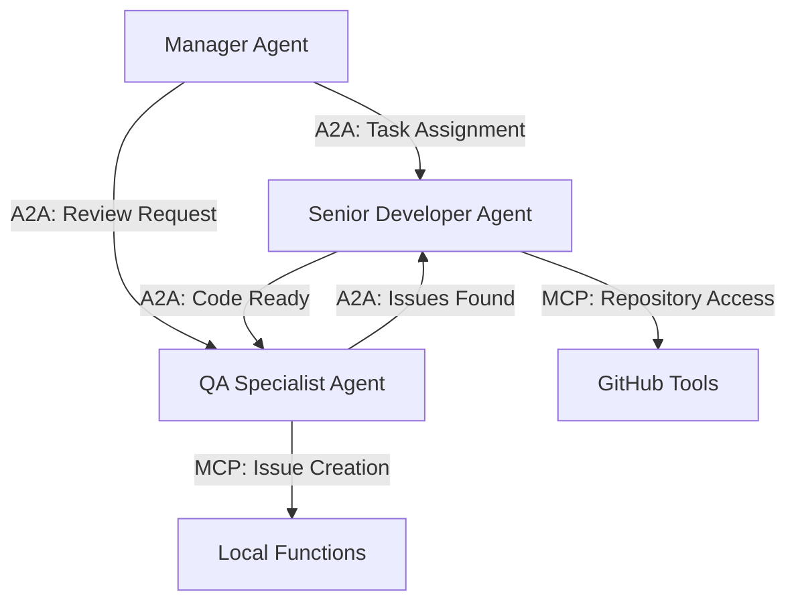

<Note>
  **Module Summary**

  - **Goal**: Create a Manager Agent that coordinates multiple agents using A2A protocols
  - **Estimated Time**: 30-35 minutes
  - **Prerequisites**: Completed Modules 1-2, have two working coding agents
</Note>

🎯 In this final module, you'll create a Manager Agent that orchestrates your coding agents using Agent-to-Agent (A2A) communication protocols. This agent will demonstrate advanced multi-agent coordination patterns, task delegation, and workflow management that you can apply to any domain.

## 🏗️ Understanding A2A Orchestration

### Agent-to-Agent vs. Tool Access

Before building your Manager Agent, it's important to understand when to use A2A vs. MCP:

| Pattern | Use Case | Example |
|---------|----------|---------|
| **A2A (Agent-to-Agent)** | Coordination between autonomous agents | Manager assigns tasks to specialized agents |
| **MCP (Model Context Protocol)** | Tool access and function execution | Agent uses GitHub API or local functions |

### A2A Communication Patterns



## 🎨 Designing Your Manager Agent

### Step 1: Create the Manager Agent Foundation

1. In the xpander.ai platform, create a third agent
2. Configure it as a coordination and orchestration specialist:

```txt Agent Name
Project Manager Agent
```

```txt Role
You are a Project Manager Agent that coordinates and orchestrates multiple coding agents to complete complex software development tasks. You excel at breaking down requirements, assigning tasks to appropriate agents, managing workflows, and ensuring quality delivery.
```

```txt Goal
Your goal is to receive high-level requirements from users and coordinate your team of specialized agents (Senior Developer Agent and QA Specialist Agent) to deliver complete, tested, and documented solutions efficiently.
```

```txt Instructions
1. Break down complex requirements into clear, actionable tasks
2. Assign tasks to the most appropriate agent based on their specializations
3. Monitor progress and coordinate handoffs between agents
4. Ensure quality standards are met before marking tasks complete
5. Handle conflicts and resource allocation between agents
6. Maintain project context and ensure consistent communication
7. Use A2A protocols to communicate with other agents
8. Escalate complex decisions or blockers to the user when needed
```

### Step 2: Add Orchestration Tools

Your Manager Agent needs different tools than the coding agents:

1. Add **Amazon Bedrock** integration for A2A communication
2. Add **GitHub Issues Manager** for project tracking
3. Add **GitHub Actions Manager** for workflow coordination

<Tip>
  The Manager Agent uses Bedrock's agent capabilities to communicate with your other agents, creating true Agent-to-Agent workflows.
</Tip>

## 🤖 Implementing A2A Communication

### Step 3: Create Agent Coordination Function

Create a local function that enables A2A communication:

```python Agent Coordinator Function
# === Agent Coordinator ===
# Contract-name: xpander_run_action
# Purpose: Coordinate tasks between multiple agents using A2A protocols

import json
import time
from typing import Dict, List, Any
from dataclasses import dataclass

@dataclass
class AgentTask:
    """Represents a task assigned to an agent"""
    task_id: str
    agent_id: str
    task_type: str
    description: str
    priority: str
    status: str
    created_at: float
    dependencies: List[str]
    result: Dict[str, Any] = None

def xpander_run_action(task_description: str, task_type: str = "development", priority: str = "medium"):
    """
    Coordinate a multi-agent workflow for completing tasks
    
    Args:
        task_description: High-level description of the task
        task_type: Type of task ("development", "review", "testing", "integration")
        priority: Task priority ("low", "medium", "high", "critical")
        
    Returns:
        dict: Coordination plan and agent assignments
    """
    
    try:
        # Break down the task into subtasks
        subtasks = decompose_task(task_description, task_type)
        
        # Create agent assignments
        assignments = assign_tasks_to_agents(subtasks, priority)
        
        # Create workflow plan
        workflow = create_workflow_plan(assignments)
        
        # Generate coordination strategy
        coordination_plan = create_coordination_plan(workflow, priority)
        
        return {
            "success": True,
            "task_breakdown": subtasks,
            "agent_assignments": assignments,
            "workflow_plan": workflow,
            "coordination_plan": coordination_plan,
            "estimated_completion": estimate_completion_time(assignments),
            "next_actions": get_next_actions(assignments)
        }
        
    except Exception as e:
        return {
            "success": False,
            "error": str(e),
            "message": "Task coordination failed"
        }

def decompose_task(description: str, task_type: str) -> List[Dict[str, Any]]:
    """Break down a high-level task into subtasks"""
    
    subtasks = []
    
    if task_type == "development":
        subtasks = [
            {
                "id": "analyze_requirements",
                "title": "Analyze Requirements",
                "description": f"Analyze the requirements for: {description}",
                "type": "analysis",
                "agent_type": "developer",
                "estimated_time": 10
            },
            {
                "id": "design_solution",
                "title": "Design Solution",
                "description": "Create technical design and architecture",
                "type": "design",
                "agent_type": "developer",
                "estimated_time": 15,
                "dependencies": ["analyze_requirements"]
            },
            {
                "id": "implement_code",
                "title": "Implement Code",
                "description": "Write the implementation code",
                "type": "implementation",
                "agent_type": "developer", 
                "estimated_time": 30,
                "dependencies": ["design_solution"]
            },
            {
                "id": "review_code",
                "title": "Review Code",
                "description": "Perform comprehensive code review",
                "type": "review",
                "agent_type": "qa",
                "estimated_time": 15,
                "dependencies": ["implement_code"]
            },
            {
                "id": "generate_tests",
                "title": "Generate Tests",
                "description": "Create comprehensive test suite",
                "type": "testing",
                "agent_type": "qa",
                "estimated_time": 20,
                "dependencies": ["implement_code"]
            },
            {
                "id": "integration_test",
                "title": "Integration Testing",
                "description": "Perform integration and final validation",
                "type": "integration",
                "agent_type": "qa",
                "estimated_time": 10,
                "dependencies": ["review_code", "generate_tests"]
            }
        ]
    
    elif task_type == "review":
        subtasks = [
            {
                "id": "code_analysis",
                "title": "Code Analysis",
                "description": f"Analyze code for: {description}",
                "type": "analysis",
                "agent_type": "qa",
                "estimated_time": 15
            },
            {
                "id": "quality_check",
                "title": "Quality Assessment",
                "description": "Assess code quality and standards",
                "type": "quality",
                "agent_type": "qa",
                "estimated_time": 10,
                "dependencies": ["code_analysis"]
            },
            {
                "id": "improvement_plan",
                "title": "Create Improvement Plan",
                "description": "Plan improvements based on findings",
                "type": "planning",
                "agent_type": "developer",
                "estimated_time": 10,
                "dependencies": ["quality_check"]
            }
        ]
    
    return subtasks

def assign_tasks_to_agents(subtasks: List[Dict], priority: str) -> List[Dict[str, Any]]:
    """Assign subtasks to appropriate agents"""
    
    # Agent mappings based on specialization
    agent_mapping = {
        "developer": "senior-developer-agent",
        "qa": "qa-specialist-agent"
    }
    
    assignments = []
    
    for subtask in subtasks:
        agent_id = agent_mapping.get(subtask["agent_type"], "senior-developer-agent")
        
        assignment = {
            "task_id": subtask["id"],
            "agent_id": agent_id,
            "agent_type": subtask["agent_type"],
            "title": subtask["title"],
            "description": subtask["description"],
            "priority": priority,
            "estimated_time": subtask["estimated_time"],
            "dependencies": subtask.get("dependencies", []),
            "status": "pending"
        }
        
        assignments.append(assignment)
    
    return assignments

def create_workflow_plan(assignments: List[Dict]) -> Dict[str, Any]:
    """Create a workflow execution plan"""
    
    # Build dependency graph
    task_graph = {}
    for assignment in assignments:
        task_id = assignment["task_id"]
        dependencies = assignment["dependencies"]
        task_graph[task_id] = {
            "assignment": assignment,
            "dependencies": dependencies,
            "dependents": []
        }
    
    # Find dependents
    for task_id, task_info in task_graph.items():
        for dep in task_info["dependencies"]:
            if dep in task_graph:
                task_graph[dep]["dependents"].append(task_id)
    
    # Calculate execution stages
    stages = calculate_execution_stages(task_graph)
    
    # Identify parallel opportunities
    parallel_tasks = identify_parallel_tasks(task_graph)
    
    return {
        "task_graph": task_graph,
        "execution_stages": stages,
        "parallel_opportunities": parallel_tasks,
        "critical_path": find_critical_path(task_graph),
        "total_estimated_time": sum(a["estimated_time"] for a in assignments)
    }

def create_coordination_plan(workflow: Dict, priority: str) -> Dict[str, Any]:
    """Create detailed coordination plan"""
    
    coordination_strategy = "sequential"
    if len(workflow["parallel_opportunities"]) > 1:
        coordination_strategy = "parallel"
    
    plan = {
        "strategy": coordination_strategy,
        "priority": priority,
        "communication_pattern": determine_communication_pattern(workflow),
        "handoff_points": identify_handoff_points(workflow),
        "quality_gates": define_quality_gates(workflow),
        "escalation_triggers": define_escalation_triggers(priority),
        "monitoring_checkpoints": create_monitoring_checkpoints(workflow)
    }
    
    return plan

def estimate_completion_time(assignments: List[Dict]) -> Dict[str, Any]:
    """Estimate completion time for the entire workflow"""
    
    total_time = sum(a["estimated_time"] for a in assignments)
    
    # Consider parallel execution opportunities
    parallel_efficiency = 0.7  # Assume 70% efficiency for parallel work
    
    return {
        "sequential_time": total_time,
        "parallel_time": int(total_time * parallel_efficiency),
        "recommended_approach": "parallel" if total_time > 30 else "sequential",
        "time_unit": "minutes"
    }

def get_next_actions(assignments: List[Dict]) -> List[str]:
    """Get immediate next actions for coordination"""
    
    # Find tasks with no dependencies
    ready_tasks = [a for a in assignments if not a["dependencies"]]
    
    actions = []
    for task in ready_tasks[:2]:  # Limit to first 2 immediate tasks
        actions.append(f"Assign '{task['title']}' to {task['agent_id']}")
    
    if len(ready_tasks) > 2:
        actions.append(f"Queue {len(ready_tasks) - 2} additional tasks")
    
    return actions

# Helper functions for workflow planning
def calculate_execution_stages(task_graph: Dict) -> List[List[str]]:
    """Calculate execution stages based on dependencies"""
    stages = []
    remaining_tasks = set(task_graph.keys())
    
    while remaining_tasks:
        # Find tasks with no pending dependencies
        ready_tasks = []
        for task_id in remaining_tasks:
            deps = task_graph[task_id]["dependencies"]
            if all(dep not in remaining_tasks for dep in deps):
                ready_tasks.append(task_id)
        
        if ready_tasks:
            stages.append(ready_tasks)
            remaining_tasks -= set(ready_tasks)
        else:
            # Circular dependency or error
            stages.append(list(remaining_tasks))
            break
    
    return stages

def identify_parallel_tasks(task_graph: Dict) -> List[List[str]]:
    """Identify tasks that can be executed in parallel"""
    stages = calculate_execution_stages(task_graph)
    return [stage for stage in stages if len(stage) > 1]

def find_critical_path(task_graph: Dict) -> List[str]:
    """Find the critical path through the task graph"""
    # Simplified critical path calculation
    # In a real implementation, this would be more sophisticated
    
    # Start with tasks that have no dependencies
    start_tasks = [tid for tid, info in task_graph.items() if not info["dependencies"]]
    
    if not start_tasks:
        return []
    
    # Follow the longest path
    longest_path = []
    max_time = 0
    
    for start_task in start_tasks:
        path = trace_longest_path(task_graph, start_task)
        path_time = sum(task_graph[tid]["assignment"]["estimated_time"] for tid in path)
        
        if path_time > max_time:
            max_time = path_time
            longest_path = path
    
    return longest_path

def trace_longest_path(task_graph: Dict, start_task: str) -> List[str]:
    """Trace the longest path from a starting task"""
    # Simplified path tracing
    path = [start_task]
    current = start_task
    
    while current:
        dependents = task_graph[current]["dependents"]
        if not dependents:
            break
        
        # Choose the dependent with the longest remaining path
        next_task = max(dependents, 
                       key=lambda t: task_graph[t]["assignment"]["estimated_time"],
                       default=None)
        
        if next_task and next_task not in path:  # Avoid cycles
            path.append(next_task)
            current = next_task
        else:
            break
    
    return path

def determine_communication_pattern(workflow: Dict) -> str:
    """Determine the best communication pattern"""
    if len(workflow["parallel_opportunities"]) > 1:
        return "broadcast_and_coordinate"
    else:
        return "sequential_handoff"

def identify_handoff_points(workflow: Dict) -> List[Dict[str, str]]:
    """Identify critical handoff points between agents"""
    handoffs = []
    
    for task_id, task_info in workflow["task_graph"].items():
        for dependent in task_info["dependents"]:
            dependent_assignment = workflow["task_graph"][dependent]["assignment"]
            current_assignment = task_info["assignment"]
            
            if current_assignment["agent_id"] != dependent_assignment["agent_id"]:
                handoffs.append({
                    "from_agent": current_assignment["agent_id"],
                    "to_agent": dependent_assignment["agent_id"],
                    "task_completed": current_assignment["title"],
                    "task_starting": dependent_assignment["title"],
                    "handoff_type": "agent_transfer"
                })
    
    return handoffs

def define_quality_gates(workflow: Dict) -> List[Dict[str, Any]]:
    """Define quality gates in the workflow"""
    gates = []
    
    # Add quality gates at key points
    for task_id, task_info in workflow["task_graph"].items():
        assignment = task_info["assignment"]
        
        if assignment["agent_type"] == "qa":
            gates.append({
                "gate_id": f"quality_gate_{task_id}",
                "task_id": task_id,
                "gate_type": "quality_review",
                "criteria": ["code_quality", "test_coverage", "security"],
                "required_approval": True
            })
    
    return gates

def define_escalation_triggers(priority: str) -> List[Dict[str, Any]]:
    """Define when to escalate to human oversight"""
    
    base_triggers = [
        {
            "trigger": "task_failure_rate > 50%",
            "action": "escalate_to_human",
            "description": "Too many task failures"
        },
        {
            "trigger": "agent_communication_failure",
            "action": "restart_coordination",
            "description": "A2A communication breakdown"
        }
    ]
    
    if priority in ["high", "critical"]:
        base_triggers.extend([
            {
                "trigger": "estimated_time_exceeded_by > 25%",
                "action": "escalate_to_human", 
                "description": "High priority task delayed"
            }
        ])
    
    return base_triggers

def create_monitoring_checkpoints(workflow: Dict) -> List[Dict[str, Any]]:
    """Create monitoring checkpoints for the workflow"""
    checkpoints = []
    
    stages = workflow["execution_stages"]
    for i, stage in enumerate(stages):
        checkpoints.append({
            "checkpoint_id": f"stage_{i+1}_completion",
            "stage_number": i + 1,
            "tasks_in_stage": stage,
            "success_criteria": "all_tasks_completed",
            "monitoring_frequency": "real_time"
        })
    
    return checkpoints
```

3. Name this function **Agent Coordinator** and save it
4. Add it to your Manager Agent canvas

### Step 4: Create A2A Communication Function

Create a function to handle direct agent-to-agent communication:

```python A2A Communication Function
# === A2A Communication Handler ===
# Contract-name: xpander_run_action
# Purpose: Handle Agent-to-Agent communication protocols

import json
import time
from typing import Dict, Any, List

def xpander_run_action(
    target_agent_id: str, 
    message_type: str, 
    payload: Dict[str, Any],
    conversation_id: str = None
):
    """
    Send messages between agents using A2A protocols
    
    Args:
        target_agent_id: ID of the agent to communicate with
        message_type: Type of message ("task_assignment", "status_update", "request_review", etc.)
        payload: Message payload with task details
        conversation_id: Optional conversation thread ID
        
    Returns:
        dict: Communication result and response handling
    """
    
    try:
        # Generate conversation ID if not provided
        if not conversation_id:
            conversation_id = f"a2a_{int(time.time())}"
        
        # Create standardized A2A message
        a2a_message = create_a2a_message(
            target_agent_id, message_type, payload, conversation_id
        )
        
        # Validate message format
        validation_result = validate_a2a_message(a2a_message)
        if not validation_result["valid"]:
            return {
                "success": False,
                "error": validation_result["error"],
                "message_type": message_type
            }
        
        # Route message based on type
        routing_info = route_message(target_agent_id, message_type)
        
        # Prepare for agent invocation (this would typically use Bedrock's invoke agent)
        invocation_payload = prepare_invocation_payload(a2a_message, routing_info)
        
        return {
            "success": True,
            "message_sent": True,
            "conversation_id": conversation_id,
            "target_agent": target_agent_id,
            "message_type": message_type,
            "routing_info": routing_info,
            "invocation_payload": invocation_payload,
            "next_steps": get_next_communication_steps(message_type)
        }
        
    except Exception as e:
        return {
            "success": False,
            "error": str(e),
            "message": "A2A communication failed"
        }

def create_a2a_message(
    target_agent: str, 
    msg_type: str, 
    payload: Dict[str, Any], 
    conversation_id: str
) -> Dict[str, Any]:
    """Create standardized A2A message format"""
    
    message = {
        "protocol_version": "1.0",
        "message_id": f"msg_{int(time.time())}",
        "conversation_id": conversation_id,
        "timestamp": time.time(),
        "sender": "project-manager-agent",
        "target": target_agent,
        "message_type": msg_type,
        "payload": payload,
        "metadata": {
            "priority": payload.get("priority", "medium"),
            "requires_response": get_response_requirement(msg_type),
            "timeout": get_message_timeout(msg_type)
        }
    }
    
    return message

def validate_a2a_message(message: Dict[str, Any]) -> Dict[str, Any]:
    """Validate A2A message format and content"""
    
    required_fields = [
        "protocol_version", "message_id", "conversation_id", 
        "sender", "target", "message_type", "payload"
    ]
    
    for field in required_fields:
        if field not in message:
            return {
                "valid": False,
                "error": f"Missing required field: {field}"
            }
    
    # Validate message type
    valid_types = [
        "task_assignment", "status_update", "request_review",
        "task_completion", "error_report", "resource_request",
        "coordination_update", "quality_feedback"
    ]
    
    if message["message_type"] not in valid_types:
        return {
            "valid": False,
            "error": f"Invalid message type: {message['message_type']}"
        }
    
    # Validate payload based on message type
    payload_validation = validate_payload_by_type(
        message["message_type"], 
        message["payload"]
    )
    
    if not payload_validation["valid"]:
        return payload_validation
    
    return {"valid": True}

def validate_payload_by_type(msg_type: str, payload: Dict[str, Any]) -> Dict[str, Any]:
    """Validate payload based on message type"""
    
    validation_rules = {
        "task_assignment": ["task_id", "description", "priority"],
        "status_update": ["task_id", "status"],
        "request_review": ["code_location", "review_type"],
        "task_completion": ["task_id", "result"],
        "error_report": ["error_type", "description"],
        "resource_request": ["resource_type", "justification"],
        "coordination_update": ["update_type", "details"],
        "quality_feedback": ["target_task", "feedback"]
    }
    
    required_fields = validation_rules.get(msg_type, [])
    
    for field in required_fields:
        if field not in payload:
            return {
                "valid": False,
                "error": f"Missing required payload field for {msg_type}: {field}"
            }
    
    return {"valid": True}

def route_message(target_agent: str, message_type: str) -> Dict[str, Any]:
    """Determine message routing information"""
    
    # Agent routing table
    agent_routing = {
        "senior-developer-agent": {
            "bedrock_agent_id": "DEVELOPER_AGENT_ID",  # Would be actual Bedrock agent ID
            "preferred_communication": "direct_invoke",
            "specializations": ["coding", "architecture", "implementation"]
        },
        "qa-specialist-agent": {
            "bedrock_agent_id": "QA_AGENT_ID",  # Would be actual Bedrock agent ID
            "preferred_communication": "direct_invoke", 
            "specializations": ["testing", "quality", "review"]
        }
    }
    
    routing_info = agent_routing.get(target_agent, {})
    
    # Add message-type specific routing
    if message_type in ["task_assignment", "coordination_update"]:
        routing_info["priority"] = "high"
        routing_info["delivery_method"] = "immediate"
    else:
        routing_info["priority"] = "normal"
        routing_info["delivery_method"] = "queued"
    
    return routing_info

def prepare_invocation_payload(message: Dict[str, Any], routing: Dict[str, Any]) -> Dict[str, Any]:
    """Prepare payload for Bedrock agent invocation"""
    
    # This would be used with Amazon Bedrock's invoke agent API
    invocation_payload = {
        "agentId": routing.get("bedrock_agent_id"),
        "agentAliasId": "TSTALIASID",  # Would be actual alias ID
        "sessionId": message["conversation_id"],
        "inputText": format_message_for_agent(message),
        "enableTrace": True,
        "endSession": False
    }
    
    return invocation_payload

def format_message_for_agent(message: Dict[str, Any]) -> str:
    """Format A2A message for agent consumption"""
    
    msg_type = message["message_type"]
    payload = message["payload"]
    
    if msg_type == "task_assignment":
        return f"""
New task assignment:
Task ID: {payload.get('task_id', 'N/A')}
Description: {payload.get('description', 'No description')}
Priority: {payload.get('priority', 'medium')}
Requirements: {payload.get('requirements', 'See task description')}

Please acknowledge receipt and provide estimated completion time.
"""
    
    elif msg_type == "request_review":
        return f"""
Code review request:
Location: {payload.get('code_location', 'Not specified')}
Review Type: {payload.get('review_type', 'comprehensive')}
Focus Areas: {', '.join(payload.get('focus_areas', ['general']))}

Please perform the requested review and provide feedback.
"""
    
    elif msg_type == "status_update":
        return f"""
Status update request for task: {payload.get('task_id', 'N/A')}
Current status: {payload.get('status', 'unknown')}

Please provide detailed progress update.
"""
    
    else:
        return f"""
{msg_type.replace('_', ' ').title()} message:
{json.dumps(payload, indent=2)}
"""

def get_response_requirement(message_type: str) -> bool:
    """Determine if message requires a response"""
    
    response_required = {
        "task_assignment": True,
        "status_update": False,
        "request_review": True,
        "task_completion": False,
        "error_report": True,
        "resource_request": True,
        "coordination_update": False,
        "quality_feedback": False
    }
    
    return response_required.get(message_type, False)

def get_message_timeout(message_type: str) -> int:
    """Get timeout in seconds for message type"""
    
    timeouts = {
        "task_assignment": 300,  # 5 minutes
        "status_update": 60,     # 1 minute
        "request_review": 600,   # 10 minutes
        "task_completion": 30,   # 30 seconds
        "error_report": 120,     # 2 minutes
        "resource_request": 180, # 3 minutes
        "coordination_update": 60,
        "quality_feedback": 300
    }
    
    return timeouts.get(message_type, 300)

def get_next_communication_steps(message_type: str) -> List[str]:
    """Get recommended next steps after sending message"""
    
    next_steps = {
        "task_assignment": [
            "Wait for agent acknowledgment",
            "Monitor task progress",
            "Prepare for status updates"
        ],
        "request_review": [
            "Wait for review completion",
            "Prepare to process feedback",
            "Plan follow-up actions"
        ],
        "status_update": [
            "Continue monitoring",
            "Update project timeline",
            "Notify stakeholders if needed"
        ]
    }
    
    return next_steps.get(message_type, ["Monitor for response"])
```

4. Name this function **A2A Communication Handler** and save it
5. Add it to your Manager Agent canvas

## 🎭 Testing Multi-Agent Coordination

### Step 5: Deploy and Test Your Manager Agent

1. **Deploy your Manager Agent** by clicking **Deploy** in the workbench
2. **Test the coordination workflow** with this comprehensive prompt:

```txt Multi-Agent Test Prompt
I need to implement a Python function that calculates the Fibonacci sequence using memoization. The function should be efficient, well-tested, and include proper error handling. Please coordinate this task across your development team.

Requirements:
- Function should handle edge cases (negative numbers, zero)
- Include comprehensive unit tests
- Ensure code quality meets production standards
- Document the implementation properly
```

3. **Observe the A2A workflow** as your Manager Agent:
   - Breaks down the task into subtasks
   - Assigns development work to the Senior Developer Agent
   - Coordinates code review with the QA Specialist Agent
   - Manages handoffs between agents
   - Ensures quality standards are met

<Frame>
  
</Frame>

### Step 6: Monitor A2A Communication

Watch how your agents communicate:

1. **Task Assignment**: Manager → Developer
2. **Code Generation**: Developer creates implementation
3. **Review Request**: Manager → QA Agent
4. **Quality Feedback**: QA → Developer (via Manager)
5. **Refinement**: Developer addresses feedback
6. **Final Approval**: QA → Manager → User

<Tip>
  You can see the A2A communication in action by monitoring the agent logs and conversation threads. Each agent maintains context about their role in the larger workflow.
</Tip>

## 🎯 Advanced A2A Patterns

### Step 7: Implement Error Handling and Recovery

Test your system's resilience with challenging scenarios:

```txt Error Handling Test
Create a complex web scraping function, but introduce a deliberate error in the requirements (ask for something impossible). See how the agents handle the error, communicate about it, and work together to find a solution.
```

### Step 8: Test Parallel Coordination

Try a task that requires parallel work:

```txt Parallel Work Test
Create a data processing pipeline with the following components:
1. Data validation module
2. Data transformation functions  
3. Export utilities
4. Comprehensive test suite

The validation and transformation work can be done in parallel, while tests depend on both.
```

## 🔄 Understanding What You've Built

### Custom Agent Architecture Patterns

Your three-agent system demonstrates key patterns applicable to any domain:

1. **Specialization**: Each agent excels in specific areas
2. **Coordination**: Manager orchestrates complex workflows
3. **Communication**: A2A protocols enable autonomous collaboration
4. **Quality Assurance**: Built-in review and validation processes
5. **Scalability**: Easy to add new specialized agents

### Beyond Coding Agents

The same A2A patterns work for any domain:

```txt Content Creation Example
- Content Strategist Agent (plans content)
- Writer Agent (creates content)  
- Editor Agent (reviews and refines)
- SEO Specialist Agent (optimizes for search)
- Manager coordinates the editorial workflow
```

```txt Sales Process Example
- Lead Research Agent (finds prospects)
- Outreach Agent (initial contact)
- Sales Development Agent (qualification)
- Account Manager Agent (closing)
- Manager orchestrates the entire sales process
```

## ✅ Workshop Completion

Congratulations! You've successfully built a complete multi-agent system with A2A coordination. You now understand:

### Key Concepts Mastered

1. **Custom Agent Design** - Creating domain-specific agents with specialized roles
2. **Local Functions** - Implementing custom logic and operations within agents
3. **A2A Communication** - Agent-to-Agent protocols for coordination and collaboration
4. **Multi-Agent Orchestration** - Managing complex workflows across multiple agents
5. **Quality Assurance** - Building quality gates and review processes into workflows

### Practical Skills Gained

- **Agent Specialization**: Designing focused, expert agents for specific domains
- **Workflow Coordination**: Breaking down complex tasks and managing dependencies
- **A2A vs MCP**: Understanding when to use agent communication vs. tool access
- **Error Handling**: Building resilient multi-agent systems
- **Quality Control**: Implementing automated review and validation processes

## 🚀 Next Steps and Applications

### Extending Your Agent System

1. **Add More Specialists**: Create agents for documentation, deployment, monitoring
2. **Domain Adaptation**: Apply these patterns to your specific use case
3. **Integration**: Connect with existing tools and systems
4. **Scaling**: Handle larger teams and more complex workflows

### Real-World Applications

Your multi-agent system can be adapted for:

- **Software Development**: End-to-end development workflows
- **Content Creation**: Editorial and publishing processes  
- **Data Analysis**: Multi-stage data processing pipelines
- **Customer Service**: Multi-tier support and escalation
- **Project Management**: Complex project coordination and delivery

### Community and Resources

- **Share Your Experience**: Join the xpander.ai community to share learnings
- **Explore Templates**: Use your system as a template for other domains
- **Contribute**: Help improve the patterns and documentation

## 🎉 Workshop Complete!

You've successfully completed the A2A Custom Agents Workshop! You now have the knowledge and practical experience to build sophisticated multi-agent systems using xpander.ai. These patterns and techniques can be applied to virtually any domain where coordination and collaboration between specialized agents can improve outcomes.

**What you've built:**
- Three specialized coding agents working together
- A2A communication protocols for agent coordination
- Local functions for custom operations
- Quality assurance and review processes
- A complete multi-agent workflow system

**What you can build next:**
- Domain-specific agent systems for your use case
- Larger agent teams with more specializations  
- Integration with existing business processes
- Production-ready multi-agent applications

Great work completing this comprehensive workshop on custom agents and A2A communication! 