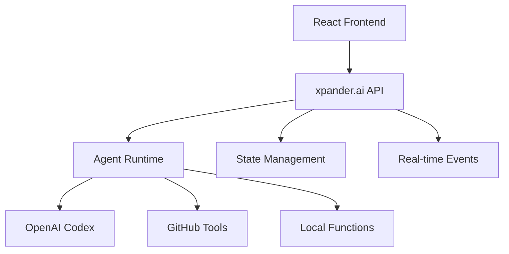

<Note>
  **Module Summary**

  - **Goal**: Set up xpander.ai backend and understand SWE agent architecture
  - **Estimated Time**: 10-15 minutes
  - **Prerequisites**: xpander.ai account, basic agent concepts
</Note>

## SWE Agent Architecture

### Core Stack
- **Frontend**: React dashboard (Codex GPT replica)
- **Backend**: xpander.ai Backend-as-a-Service
- **LLM**: OpenAI Codex CLI for code generation
- **Tools**: GitHub operations
- **State**: Distributed multi-user state management

### Architecture Diagram



## Backend-as-a-Service Benefits

| Component | Traditional Setup | xpander.ai BaaS |
|-----------|-------------------|-----------------|
| **Infrastructure** | Manual server setup | Managed, auto-scaling |
| **State Management** | Custom implementation | Built-in distributed state |
| **Tool Integration** | Manual API wrappers | MCP-compatible library |
| **Real-time Events** | WebSocket implementation | Event streaming included |
| **Multi-user Support** | Complex auth & isolation | Built-in multi-tenancy |
| **Deployment** | DevOps overhead | One-command deployment |

## Quick Setup

### 1. Template Import
[](https://app.xpander.ai/templates/14c5e651-a207-4a60-8dd6-143e147df890)

<Frame>
  <video
    autoPlay
    muted
    loop
    playsInline
    className="w-full aspect-video"
    src="https://assets.xpanderai.io/workshops/videos/import-process.mp4"
  ></video>
</Frame>

<Tip>
**xpander.ai** provides built-in templates for AI agents across popular use cases like coding, meeting recording, document summarization, Notion integration, and more.  
You can **easily import** these templates to kickstart your agents without building from scratch.
</Tip>

### 2. 🧠 Your Coding Agent

Your agent is now ready and can code & interact with GitHub—listing, creating, updating, and commenting on pull requests.


<Tip>

Powered by an enhanced **Codex CLI**, the agent integrates natively with GitHub via xpander’s interfaces. One-click auth. Instant coding.

</Tip>


### 3. 🚗 Test Drive Your Agent

Let’s walk through a real GitHub workflow using your agent. We'll use the `xpander-ai/apps-by-agents` repository and test out some core capabilities.

---

#### 🪄 Step 1: List Pull Requests

Ask your agent:

```text
List all pull requests (open or closed) in "xpander-ai/apps-by-agents"
```


---

#### 🧠 Step 2: Summarize the Latest PR

Then ask:

```text
Explain the most recent pull request and what the code changes do.
```


## Competition Metrics

Production SWE agents are evaluated on:
- **Task Completion**: 85-95% success rate
- **Response Time**: less than 30s for simple tasks
- **Code Quality**: Static analysis scores >8/10
- **System Reliability**: 99.9% uptime

## Next Steps

Coding agent configured → Build frontend management app (Module 2) 