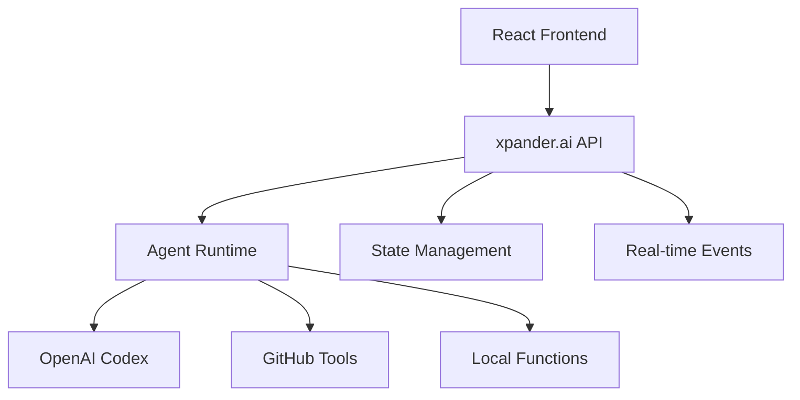

<Note>
  **Module Summary**

  - **Goal**: Set up xpander.ai backend and understand SWE agent architecture
  - **Estimated Time**: 10-15 minutes
  - **Prerequisites**: xpander.ai account, basic agent concepts
</Note>

## SWE Agent Architecture

### Core Stack

- **Frontend**: React dashboard (Similar to ChatGPT-Codex)
- **Backend**: xpander.ai Backend-as-a-Service
- **LLM / coding agent**: OpenAI Codex CLI for code generation
- **Agent tools**: Various GitHub operations
- **State**: Distributed multi-user state management

### Architecture Diagram



## Backend-as-a-Service Benefits

| Component              | Traditional Setup        | xpander.ai BaaS            |
| ---------------------- | ------------------------ | -------------------------- |
| **Infrastructure**     | Manual server setup      | Managed, auto-scaling      |
| **State Management**   | Custom implementation    | Built-in distributed state |
| **Tool Integration**   | Manual API wrappers      | MCP-compatible library     |
| **Real-time Events**   | WebSocket implementation | Event streaming included   |
| **Multi-user Support** | Complex auth & isolation | Built-in multi-tenancy     |
| **Deployment**         | DevOps overhead          | One-command deployment     |

## Quick Setup

### 1. Template Import

<Frame>
  <video autoPlay muted loop playsInline className="w-full aspect-video" src="https://assets.xpanderai.io/workshops/videos/import-process.mp4" />
</Frame>

<Tip>
  **xpander.ai** provides built-in templates for AI agents across popular use cases like coding, meeting recording, document summarization, Notion integration, and more.\
  You can **easily import** these templates to kickstart your agents without building from scratch.
</Tip>

### 2. 🧠 Your Coding Agent

You are now seeing the AI Workbench - a user interface used to design, deploy, test and observe agents. 

<Tip>
  The left side of the AI Workbench can be used to easily intract with your agent and see how it behaves in real time - we will do that in a minute.

  The right side is a visual representation of your agent or multi-agent team, including its different triggering capabilities and its available tools.
</Tip>

Check out the available tools your agent has. Tt can interact with GitHub - listing, creating, updating, and commenting on pull requests. More importantly, it code using the built-in Coding agent, built on an enhanced version of Codex CLI.


### 3. 🚗 Test Drive Your Agent

Let’s walk through a real GitHub workflow using your agent. We'll use the `xpander-ai/apps-by-agents` repository and test out some core capabilities.

---

#### 🪄 Step 1: List Pull Requests

Ask your agent:

```text
List all pull requests (open or closed) in "xpander-ai/apps-by-agents"
```


---

#### 🧠 Step 2: Summarize the Latest PR

Then ask:

```text
Explain the most recent pull request and what the code changes do.
```


## Competition Metrics

Production SWE agents are evaluated on:

- **Task Completion**: 85-95% success rate
- **Response Time**: less than 30s for simple tasks
- **Code Quality**: Static analysis scores \>8/10
- **System Reliability**: 99.9% uptime

## Next Steps

Coding agent configured → Build frontend management app (Module 2)