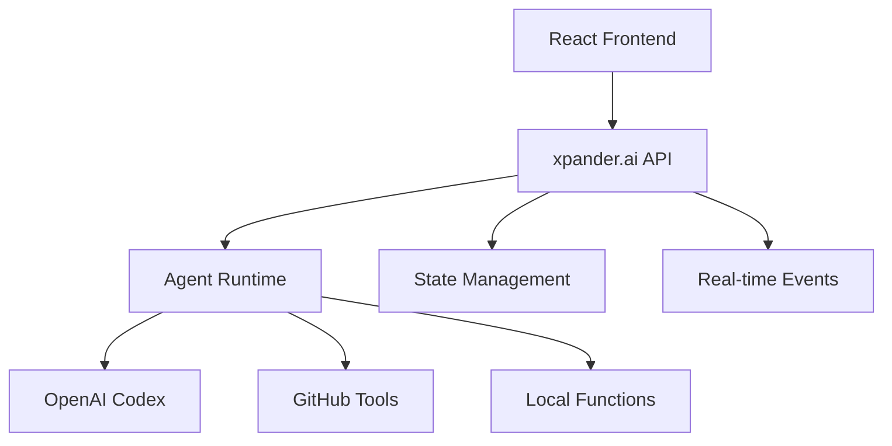

<Note>
  **Module Summary**

  - **Goal**: Set up xpander.ai backend and understand SWE agent architecture
  - **Estimated Time**: 10-15 minutes
  - **Prerequisites**: xpander.ai account, basic agent concepts
</Note>

## SWE Agent Architecture

### Core Stack
- **Frontend**: React dashboard (Codex GPT replica)
- **Backend**: xpander.ai Backend-as-a-Service
- **LLM**: OpenAI Codex CLI for code generation
- **Tools**: GitHub operations, local functions
- **State**: Distributed multi-user state management

### Architecture Diagram



## Backend-as-a-Service Benefits

| Component | Traditional Setup | xpander.ai BaaS |
|-----------|-------------------|-----------------|
| **Infrastructure** | Manual server setup | Managed, auto-scaling |
| **State Management** | Custom implementation | Built-in distributed state |
| **Tool Integration** | Manual API wrappers | MCP-compatible library |
| **Real-time Events** | WebSocket implementation | Event streaming included |
| **Multi-user Support** | Complex auth & isolation | Built-in multi-tenancy |
| **Deployment** | DevOps overhead | One-command deployment |

## Quick Setup

### 1. Template Import
```bash
# Option A: Use pre-built template
xpander template import swe-cloud-agent

# Option B: Start from scratch
xpander agent new --type swe
```

### 2. Backend Configuration
```python
# xpander_handler.py
from xpander_sdk import XpanderClient, Agent

def on_execution_request(execution_task: AgentExecution) -> AgentExecutionResult:
    # Your custom agent loop here
    result = your_swe_agent.process(execution_task.input.text)
    return AgentExecutionResult(
        result=result,
        is_success=True
    )
```

### 3. Agent Instrumentation
```python
xpander_client = XpanderClient(api_key="YOUR_API_KEY")
agent: Agent = xpander_client.agents.get("YOUR_AGENT_ID")

# Auto-loaded state and tools
response = openai_client.chat.completions.create(
    model="gpt-4o",
    messages=agent.messages,  # Current conversation state
    tools=agent.get_tools(),  # Cloud-managed tool schemas
    tool_choice=agent.tool_choice
)

# State persistence and tool execution
agent.add_messages(response.model_dump())
tool_calls = XpanderClient.extract_tool_calls(response.model_dump())
agent.run_tools(tool_calls=tool_calls)
```

## Key Capabilities

### Custom Agent Loops
- **LLM Flexibility**: Switch between OpenAI, Anthropic, local models
- **Local Functions**: Execute custom code within agent context
- **Framework Agnostic**: Use with any agent framework or raw LLM APIs

### Tool Integration
- **MCP Compatible**: Access comprehensive tools library
- **GitHub Operations**: Repository management, PR creation, issue tracking
- **Code Analysis**: Static analysis, quality metrics, security scanning

### Production Features
- **State Persistence**: Conversation memory across sessions
- **Real-time Monitoring**: Task status, logs, performance metrics
- **A2A Communication**: Agent-to-agent messaging and coordination
- **API Guardrails**: Dependency management for tool chains

## Deployment Options

### Serverless (Default)
```bash
xpander deploy  # Managed infrastructure
xpander logs    # Stream logs locally
```

### Self-hosted Migration
```python
# Keep same codebase, deploy anywhere
docker build -t my-swe-agent .
kubectl apply -f k8s-deployment.yaml
```

## Testing Backend

### 1. Basic Functionality
```bash
curl -X POST "https://api.xpander.ai/agents/YOUR_AGENT_ID/execute" \
  -H "Authorization: Bearer YOUR_API_KEY" \
  -d '{"input": "Analyze repository structure of github.com/user/repo"}'
```

### 2. Tool Verification
```python
# Test tool availability
tools = agent.get_tools()
github_tools = [t for t in tools if 'github' in t['function']['name']]
print(f"Available GitHub tools: {len(github_tools)}")
```

### 3. State Management
```python
# Verify state persistence
agent.add_task("Remember: I'm working on feature X")
# ... later session ...
messages = agent.messages  # Previous context automatically loaded
```

## Competition Metrics

Production SWE agents are evaluated on:
- **Task Completion**: 85-95% success rate
- **Response Time**: less than 30s for simple tasks
- **Code Quality**: Static analysis scores >8/10
- **System Reliability**: 99.9% uptime

## Next Steps

Backend configured → Build frontend dashboard (Module 2) 