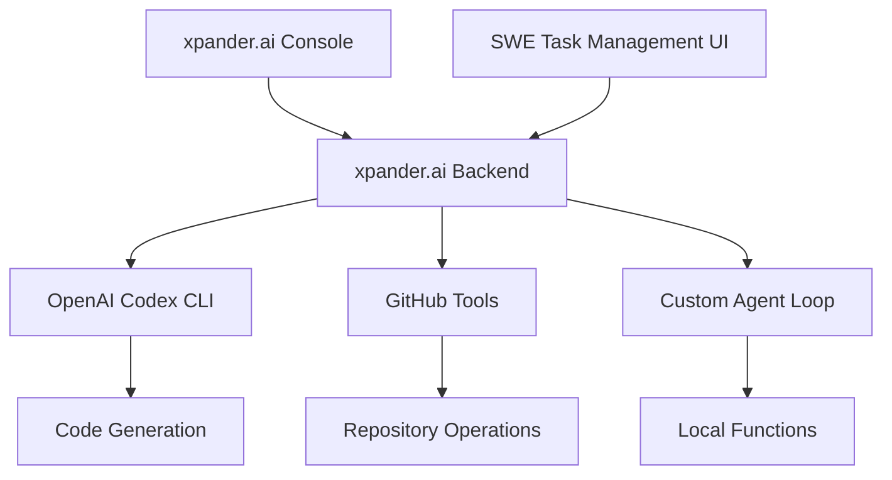

# SWE Cloud Agent Workshop

## Workshop introduction

What this workshop covers:
- Running a customizable SWE agent in the cloud, with built in tools: Coding (based on Codex CLI) and Github access
- Running agents on a managed Backend-as-a-Service platform, designed specifically for AI agents
- Deploy a Codex-GPT style frontend for managing the SWE agent tasks, logs and status
- Configure and test your AI Agent through a visual Workbench

End goal: A fully customizable version of ChatGPT-Codex, controlled and configured by you, ready to take on coding tasks, connect to any tool and agent, and be triggered from anywhere.

### Solution architecture

## Intro to xpander.ai Backend-as-a-Service for agents

Framework-agnostic backend for scalable, real-time AI agents.

| Feature        | Description                                          |
| -------------- | ---------------------------------------------------- |
| 🛠️ Frameworks | Use OpenAI, LangChain, CrewAI, Agno, or raw LLM APIs |
| ⚙️ Tools       | Plug-and-play MCP-compatible tools                   |
| ⚡ Events       | Built-in streaming: WebUI, Slack, Webhooks           |
| 💾 State       | Multi-user, distributed out of the box               |
| 🚀 Hosting     | Auto-scaling infra, one-command deploy               |
| 🛡️ Guardrails | Tool dependency safety via agent graphs              |

## Workshop prerequisites

- On your dev machine, have Python 3.12 & Node.js 22
- Github account

Ready to build a production-grade SWE agent system? Start with **Module 1**\!