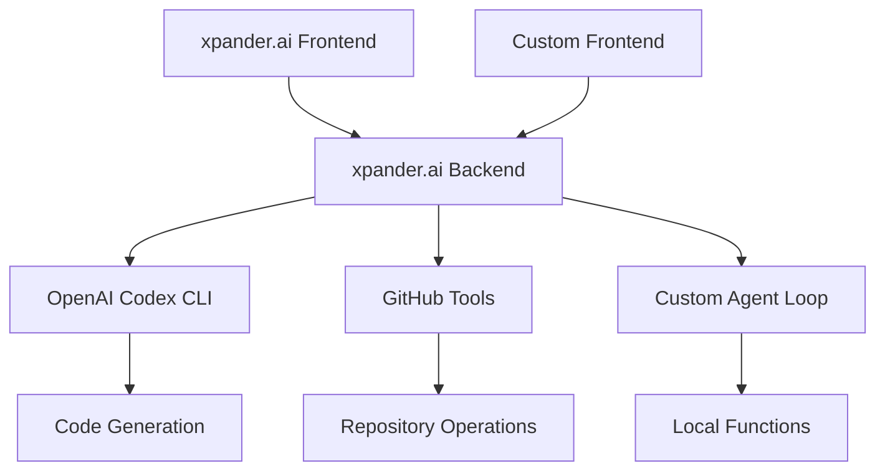

# SWE Cloud Agent Workshop

<Frame>
  
</Frame>

Build a complete cloud-based Software Engineering agent system: a Codex GPT-like frontend showing tasks/status/logs + customizable agent backend with deployment options.

## Architecture Overview

**Frontend**: Build your own Codex GPT replica displaying:
- Real-time task execution status
- Agent activity logs and monitoring  
- Code generation results
- Repository management interface

**Backend**: Leverage xpander.ai's Backend-as-a-Service for agents:
- Framework-agnostic infrastructure
- Custom agent loops with any LLM model
- Local function execution
- Serverless → self-hosted deployment path

## xpander.ai Backend-as-a-Service Benefits

| Component              | Traditional Setup        | xpander.ai BaaS            |
| ---------------------- | ------------------------ | -------------------------- |
| **Infrastructure**     | Manual server setup      | Managed, auto-scaling      |
| **State Management**   | Custom implementation    | Built-in distributed state |
| **Tool Integration**   | Manual API wrappers      | MCP-compatible library     |
| **Real-time Events**   | WebSocket implementation | Event streaming included   |
| **Multi-user Support** | Complex auth & isolation | Built-in multi-tenancy     |
| **Deployment**         | DevOps overhead          | One-command deployment     |

## What You'll do during this workshop

- **Use xpander.ai built-in frontend**: Chat interface to to talk with you agent
- **Task Management Frontend**: React dashboard for SWE agent operations
- **Agent Backend**: Customizable loops with OpenAI Codex integration
- **Cloud Deployment**: Production-ready system with monitoring
- **Competition Submission**: Package for apps-by-agent competitions

## xpander.ai Backend-as-a-Service

Framework-agnostic infrastructure for autonomous agents:

| Feature | Description |
|---------|-------------|
| 🛠️ **Framework Flexibility** | OpenAI SDK, Agno, CrewAI, LangChain, or native LLM APIs |
| 🧰 **Tool Integration** | MCP-compatible tools library and pre-built integrations |
| 🚀 **Scalable Hosting** | Managed infrastructure with auto-scaling |
| 💾 **State Management** | Distributed state with multi-user support |
| ⚡ **Real-time Events** | Agent2Agent, Slackbots, WebUI, Webhooks |
| 🛡️ **API Guardrails** | Agent-Graph-System for tool dependencies |

## Workshop Modules

<CardGroup cols={2}>
  <Card title="1. Architecture & Backend Setup" icon="server" href="/workshops/swe-cloud-agent-workshop/01-intro-cloud-swe-agents" color="#4A2C99">
    Backend template setup and agent configuration
  </Card>
  
  <Card title="2. Frontend Build & Testing" icon="desktop" href="/workshops/swe-cloud-agent-workshop/02-load-backend-template" color="#753CFF">
    Simple React frontend with 5-line integration
  </Card>
  
  <Card title="3. Competition Submission" icon="trophy" href="/workshops/swe-cloud-agent-workshop/03-submit-competition" color="#9B70FF">
    Package and submit to apps-by-agent competitions
  </Card>
  
  <Card title="4. Advanced Customization (Optional)" icon="gear" href="/workshops/swe-cloud-agent-workshop/04-advanced-customization" color="#6B46C1">
    Run your own agent loop and customize further
  </Card>
</CardGroup>

## Prerequisites

- **Development**: Python 3.12, Node.js v22, React experience
- **Backend**: xpander.ai account, OpenAI API access
- **Integration**: GitHub account with repository permissions

## Key Learning Outcomes

- **Agent Architecture**: Design patterns for production SWE agents
- **Frontend Development**: Real-time dashboards for agent monitoring
- **Backend Customization**: Custom agent loops and LLM model switching
- **Deployment Strategies**: Serverless → self-hosted migration paths
- **Competition Readiness**: Professional submission packaging

Ready to build a production SWE agent system? Start with Module 1! 