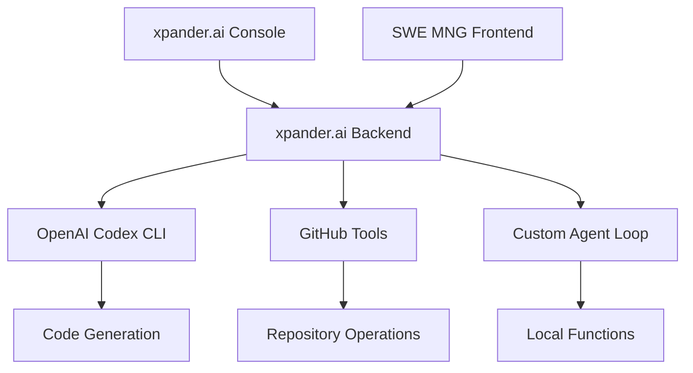

# SWE Cloud Agent Workshop

## Workshop introduction

What this workshop covers:
- Running a customizable SWE agent in the cloud, with built in tools: Coding (based on Codex CLI) and Github access
- Running agents on a managed Backend-as-a-Service platform, designed specifically for AI agents
- Deploy a Codex-GPT style frontend for managing the SWE agent tasks, logs and status
- Configure and test your AI Agent through a visual Workbench

End goal: A fully customizable version of ChatGPT-Codex, controlled and configured by you, ready to take on coding tasks, connect to any tool and agent, and be triggered from anywhere.

### Solution architecture

## Intro to xpander.ai Backend-as-a-Service for agents

Framework-agnostic backend for scalable, real-time AI agents.

| Feature        | Description                                          |
| -------------- | ---------------------------------------------------- |
| 🛠️ Frameworks | Use OpenAI, LangChain, CrewAI, Agno, or raw LLM APIs |
| ⚙️ Tools       | Plug-and-play MCP-compatible tools                   |
| ⚡ Events       | Built-in streaming: WebUI, Slack, Webhooks           |
| 💾 State       | Multi-user, distributed out of the box               |
| 🚀 Hosting     | Auto-scaling infra, one-command deploy               |
| 🛡️ Guardrails | Tool dependency safety via agent graphs              |

## Workshop prerequisites

- On your dev machine, have Python 3.12 & Node.js 22
- Github account

## Workshop Modules

<CardGroup cols={2}>
  <Card title="1. Architecture & Backend Setup" icon="server" color="#4A2C99" href="/workshops/swe-cloud-agent-workshop/01-intro-cloud-swe-agents">
    Backend template setup and agent configuration
  </Card>
  <Card title="2. Frontend Build & Testing" icon="desktop" color="#753CFF" href="/workshops/swe-cloud-agent-workshop/02-load-backend-template">
    Simple React frontend with 5-line integration
  </Card>
  <Card title="3. Competition Submission" icon="trophy" color="#9B70FF" href="/workshops/swe-cloud-agent-workshop/03-submit-competition">
    Package and submit to apps-by-agent competitions
  </Card>
  <Card title="4. Advanced Customization (Optional)" icon="gear" color="#6B46C1" href="/workshops/swe-cloud-agent-workshop/04-advanced-customization">
    Run your own agent loop and customize further
  </Card>
</CardGroup>

Ready to build a production-grade SWE agent system? Start with **Module 1**\!