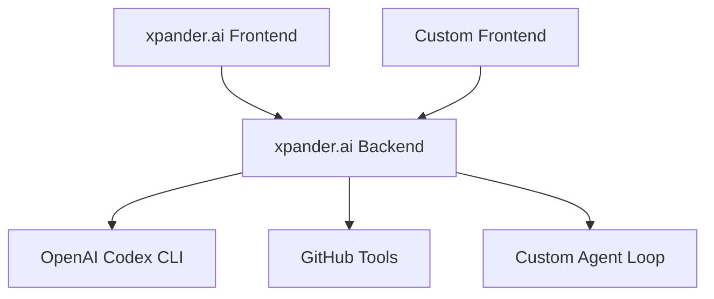

# SWE Cloud Agent Workshop

Build a complete cloud-based Software Engineering agent system: a Codex-GPT-style frontend for task/status/logs, plus a customizable agent backend with deployment options.

## Architecture Overview

## What You'll Do in This Workshop

- **Use xpander.ai’s built-in frontend**: Chat with your agent via a prebuilt UI
- **Task Management Frontend**: React dashboard for SWE agent operations
- **Agent Backend**: Customizable loops with OpenAI Codex integration
- **Cloud Deployment**: Production-ready system with monitoring
- **Competition Submission**: Agent built app for apps-by-agent competitions

## Workshop Modules

<CardGroup cols={2}>
  <Card title="1. Architecture & Backend Setup" icon="server" color="#4A2C99" href="/workshops/swe-cloud-agent-workshop/01-intro-cloud-swe-agents">
    Backend template setup and agent configuration
  </Card>
  <Card title="2. Frontend Build & Testing" icon="desktop" color="#753CFF" href="/workshops/swe-cloud-agent-workshop/02-load-backend-template">
    Simple React frontend with 5-line integration
  </Card>
  <Card title="3. Competition Submission" icon="trophy" color="#9B70FF" href="/workshops/swe-cloud-agent-workshop/03-submit-competition">
    Package and submit to apps-by-agent competitions
  </Card>
  <Card title="4. Advanced Customization (Optional)" icon="gear" color="#6B46C1" href="/workshops/swe-cloud-agent-workshop/04-advanced-customization">
    Run your own agent loop and customize further
  </Card>
</CardGroup>

## xpander.ai Backend-as-a-Service

Framework-agnostic backend for scalable, real-time AI agents.

| Feature        | Description                                          |
| -------------- | ---------------------------------------------------- |
| 🛠️ Frameworks | Use OpenAI, LangChain, CrewAI, Agno, or raw LLM APIs |
| ⚙️ Tools       | Plug-and-play MCP-compatible tools                   |
| ⚡ Events       | Built-in streaming: WebUI, Slack, Webhooks           |
| 💾 State       | Multi-user, distributed out of the box               |
| 🚀 Hosting     | Auto-scaling infra, one-command deploy               |
| 🛡️ Guardrails | Tool dependency safety via agent graphs              |

**Frontend**: Codex-style UI — task status, logs, codegen, repo management\
**Backend**: Custom loops, any LLM, serverless → self-hosted

## Prerequisites

- Python 3.12 • Node.js 22 • React
- xpander.ai account • OpenAI API • GitHub repo access

Ready to build a production-grade SWE agent system? Start with **Module 1**\!